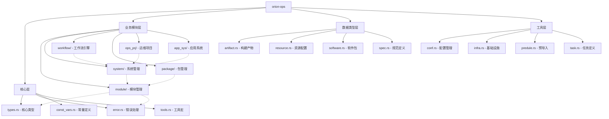

# Orion Ops 核心模块文档

## 项目概述
Orion Ops是一个用于系统配置和部署的Rust库，提供了模块化管理、系统初始化、资源配置和工作流管理等功能。

## 模块结构

### 模块层次结构图



### 核心模块
- **types.rs**: 定义核心类型和trait，包括`SysUpdateValue`、`Localizable`、`ValuePath`等
- **error.rs**: 错误处理定义
- **const_vars.rs**: 常量定义
- **tools.rs**: 工具宏和函数

### 功能模块
- **module/**: 模块管理核心，包含模块依赖、初始化、本地化等
- **system/**: 系统级配置管理，处理模块列表、资源配置
- **workflow/**: 工作流管理，支持GitHub Actions等CI/CD流程
- **package/**: 包管理相关功能
- **ops_prj/**: 运维项目配置管理
- **app_sys/**: 应用系统配置

### 数据类型
- **artifact.rs**: 构建产物定义
- **resource.rs**: 资源配置定义
- **software.rs**: 软件包定义
- **spec.rs**: 规范定义

## 核心概念

### 1. 模块系统 (Module System)
基于`ModuleSpec`和`ModuleSpecRef`构建，支持：
- 模块依赖管理
- 多平台支持（x86/arm, macOS/Linux/Windows）
- 运行时环境（Host/K8s）

### 2. 本地化系统 (Localization)
通过`Localizable` trait实现，支持：
- 变量替换
- 模板渲染
- 多环境配置

### 3. 更新系统 (Update System)
通过`SysUpdateable` trait实现，支持：
- 增量更新
- 版本控制
- 回滚机制

## 使用示例

```rust
use orion_ops::types::{ValuePath, LocalizeOptions};
use orion_ops::module::ModelSTD;

// 创建系统配置
let model_std = ModelSTD::from_cur_sys();
let value_path = ValuePath::new("/path/to/config");
```

## 依赖关系
- orion_common: 通用工具库
- orion_infra: 基础设施库
- orion_variate: 变量管理库
- serde: 序列化/反序列化
- tokio: 异步运行时
- git2: Git操作