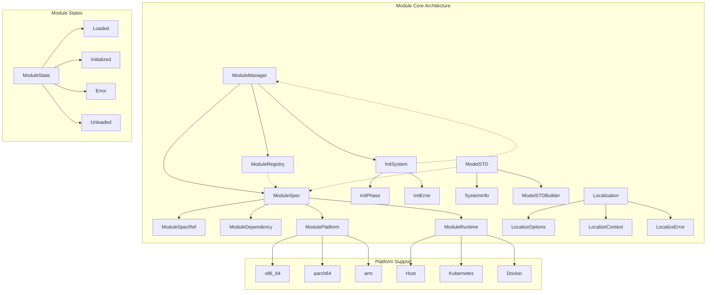

# Module 模块文档

## 概述
Module模块是Orion Ops的核心组件，负责管理系统的模块化架构。它提供了模块定义、依赖管理、初始化流程和本地化支持等功能。

## 核心组件

### 模块架构图



### 1. 模块规范 (ModuleSpec)
文件: `module_spec.rs`
- **ModuleSpec**: 完整的模块定义，包含名称、版本、依赖、配置等
- **ModuleSpecRef**: 模块引用，用于轻量级引用
- **ModuleDependency**: 模块依赖关系定义
- **ModulePlatform**: 支持的平台枚举（x86/arm, macOS/Linux/Windows）
- **ModuleRuntime**: 运行时环境（Host/K8s）

### 2. 模块管理器 (ModuleManager)
文件: `module_manager.rs`
- **ModuleManager**: 核心管理器，负责模块的加载、初始化和生命周期管理
- **ModuleState**: 模块状态枚举（Loaded, Initialized, Error等）
- **ModuleRegistry**: 模块注册表，维护所有已加载的模块

### 3. 模型标准 (ModelSTD)
文件: `model_std.rs`
- **ModelSTD**: 系统模型标准，定义当前系统的配置
- **ModelSTDBuilder**: 构建器模式创建ModelSTD实例
- **SystemInfo**: 系统信息收集（CPU、内存、磁盘等）

### 4. 本地化支持 (Localization)
文件: `localize.rs`
- **LocalizeOptions**: 本地化配置选项
- **LocalizeContext**: 本地化上下文，包含变量替换和模板渲染
- **LocalizeError**: 本地化错误类型

### 5. 初始化系统 (Init System)
文件: `init.rs`
- **InitSystem**: 系统初始化入口
- **InitPhase**: 初始化阶段枚举
- **InitError**: 初始化错误类型

## 关键特性

### 模块依赖管理
```rust
use orion_ops::module::{ModuleSpec, ModuleDependency};

let module = ModuleSpec::builder()
    .name("web-server")
    .version("1.0.0")
    .dependency(ModuleDependency::new("database", "^2.0"))
    .build();
```

### 平台适配
```rust
use orion_ops::module::ModulePlatform;

let platform = ModulePlatform::detect();
match platform {
    ModulePlatform::MacOS => println!("Running on macOS"),
    ModulePlatform::Linux => println!("Running on Linux"),
    _ => println!("Other platform"),
}
```

### 本地化配置
```rust
use orion_ops::module::{LocalizeOptions, LocalizeContext};

let options = LocalizeOptions::new()
    .with_template_dir("/templates")
    .with_variables(vec![("env", "production")]);

let context = LocalizeContext::new(options);
let rendered = context.render_template("config.yaml", &variables)?;
```

## 数据结构

### ModuleSpec结构
```rust
pub struct ModuleSpec {
    pub name: String,
    pub version: String,
    pub description: Option<String>,
    pub dependencies: Vec<ModuleDependency>,
    pub platforms: Vec<ModulePlatform>,
    pub runtime: ModuleRuntime,
    pub config: Value,
    pub scripts: HashMap<String, String>,
}
```

### ModuleDependency结构
```rust
pub struct ModuleDependency {
    pub name: String,
    pub version_req: String,
    pub optional: bool,
    pub features: Vec<String>,
}
```

## 错误处理

模块提供了完整的错误处理机制：
- **ModuleError**: 模块相关错误
- **InitError**: 初始化错误
- **LocalizeError**: 本地化错误

## 测试

模块包含完整的测试套件：
- 单元测试：测试各个组件的功能
- 集成测试：测试模块间的交互
- 平台测试：测试不同平台的兼容性

## 扩展性

模块系统设计支持：
- 自定义模块类型
- 插件式架构
- 动态加载
- 热更新

## 最佳实践

1. **模块命名**: 使用kebab-case命名模块
2. **版本管理**: 遵循语义化版本规范
3. **依赖声明**: 明确声明所有依赖，避免隐式依赖
4. **平台检测**: 使用自动平台检测，避免硬编码
5. **错误处理**: 使用Result类型处理所有可能的错误